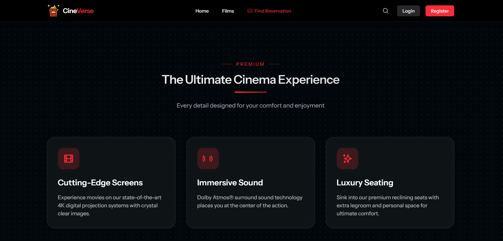

# Cinema Ticket Reservation System


A modern web-based cinema ticket reservation system built with Laravel and React, featuring real-time event processing with Apache Kafka.

## Overview

The Cinema Ticket Reservation System is a full-stack application that allows customers to browse movies, book tickets, and manage their reservations. It includes both customer-facing features and an administrative dashboard for cinema management.

## Key Features

- Movie browsing and searching
- Real-time seat selection
- Secure payment processing
- Automated ticket generation
- Admin dashboard for cinema management
- Event-driven architecture using Kafka
- Integration with OMDb API for movie data

## Tech Stack

### Backend
- Laravel PHP Framework
- SQLite Database
- Apache Kafka for event processing
- REST API architecture
- PDF generation for tickets

### Frontend
- React with TypeScript
- Tailwind CSS for styling
- Radix UI for accessible components
- Inertia.js for seamless client-server communication

## Kafka Integration

The system uses Apache Kafka for handling asynchronous events such as:
- Booking creation
- Payment processing
- Seat reservation
- Booking confirmation
- Booking cancellation

### Kafka Topics
```
- booking-created
- payment-processed
- seat-reserved
- booking-confirmed
- booking-cancelled
```

## Installation & Setup

### Prerequisites
- PHP 8.1+
- Node.js 16+
- Composer
- Docker (for Kafka)
- SQLite 3

### Step 1: Clone the Repository
```bash
git clone <repository-url>
cd cinema-ticket-reservation
```

### Step 2: Install Dependencies
```bash
composer install
npm install
```

### Step 3: Environment Setup
```bash
cp .env.example .env
php artisan key:generate
```

Configure your database and Kafka settings in `.env`:
```
DB_CONNECTION=sqlite
DB_DATABASE=database/database.sqlite

KAFKA_BROKERS=localhost:9093
KAFKA_REST_PROXY_URL=http://localhost:8082
OMDB_API_KEY=your_api_key_here
```

### Step 4: Set Up Kafka (using Docker)
```bash
cd kafka-local
docker-compose up -d
```

Create Kafka topics:
```bash
chmod +x create-topics.sh
./create-topics.sh
```

### Step 5: Database Setup
```bash
php artisan migrate
php artisan db:seed
```

### Step 6: Start the Application
```bash
# Terminal 1 - Laravel Server
php artisan serve

# Terminal 2 - Frontend Development Server
npm run dev

# Terminal 3 - Kafka Consumers
php artisan kafka:start-consumers

# Terminal 4 - run-scheduler
.\run-scheduler.ps1
```

The application will be available at `http://localhost:8000`

## Testing Kafka Integration

Test the Kafka setup using the provided scripts:

```bash
# Test Producer
php test-kafka-producer.php

# Test Consumer
php test-kafka-consumer.php
```

## Development

### Running Consumers in Development
```bash
# Start all consumers
php artisan kafka:start-consumers

# Start a specific consumer
php artisan kafka:consume booking-created
```

### Testing API Connection
```bash
# Test Kafka connection
php artisan kafka:test-connection
```

## Documentation

The project includes detailed documentation in the following files:
- [Backend Documentation](backend-documentation.md)
- [Frontend Documentation](frontend-documentation.md)
- [Database Schema](database-schema.md)
- [Class Diagram](class-diagram.md)
- [Sequence Diagrams](sequence-diagrams.md)

## Project Structure

```
├── app/
│   ├── Console/
│   ├── Http/
│   ├── Models/
│   ├── Notifications/
│   ├── Providers/
│   ├── Services/
│   └── Traits/
├── config/
├── database/
├── kafka-local/
├── resources/
├── routes/
└── tests/
```

## License

This project is licensed under the MIT License.
